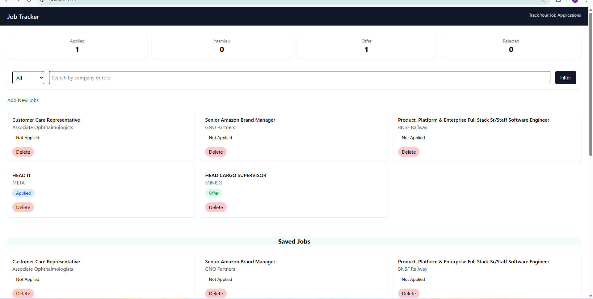
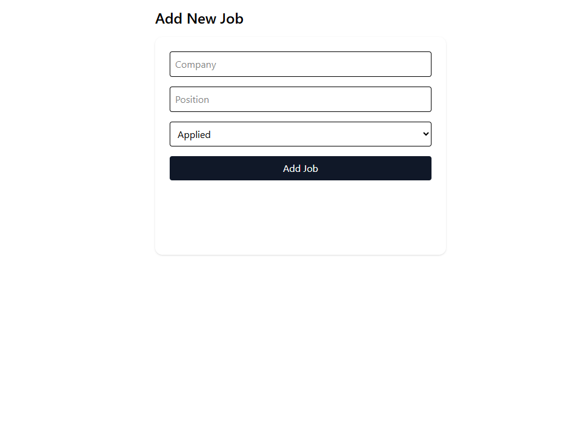
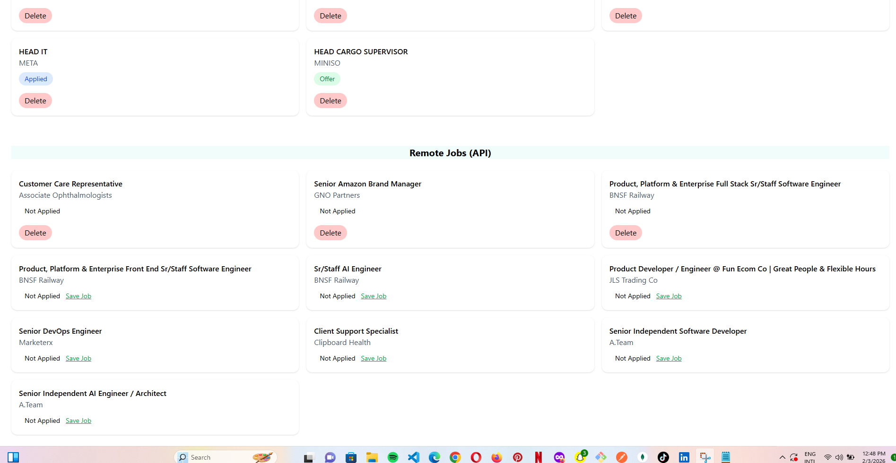

# Job Tracker Dashboard

A modern **job tracking application** built with React that helps users manage job applications, track statuses, and save remote job listings from an external API.

---

## 🌍 Live Demo
🔗 [View App](https://job-tracker-dashboard-1nzsozji0-awakan-shinayomi-rajis-projects.vercel.app)

---

## 🔥 Features
- Add and manage job applications
- Filter jobs by status and search
- Save remote jobs from an external API
- Persistent storage using localStorage
- Toast notifications for user actions
- Skeleton loaders for better UX
- Fully responsive UI with Tailwind CSS

---

## 🖥️ Tech Stack

### Frontend
- React
- React Router

### State Management
- React Context API

### Styling
- Tailwind CSS

### Notifications
- react-hot-toast

### API Integration
- External Remote Jobs API

### Data Persistence
- LocalStorage

### Deployment
- Vercel

---

## 📸 Screenshots

### Dashboard

### Add Job Form

### Remote Jobs (API)

---

## 🧠 What I Learned
- Managing global state with Context API
- Integrating and normalizing external API data
- Improving UX with skeleton loaders and toast notifications
- Deploying React apps with Vercel
- Writing a professional, recruiter-friendly README

---

## 🚀 Future Improvements
- Add authentication to track jobs per user
- Store jobs in a backend (MongoDB / Firebase)
- Analytics dashboard for job applications
- Dark mode for better user experience

---
